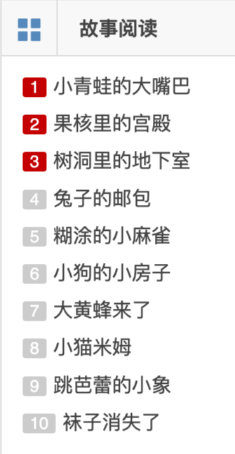
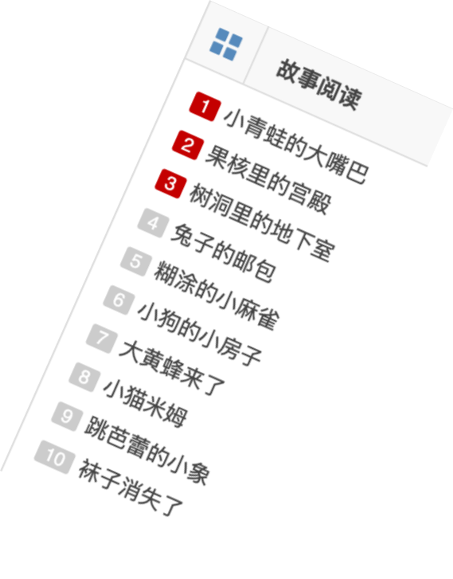
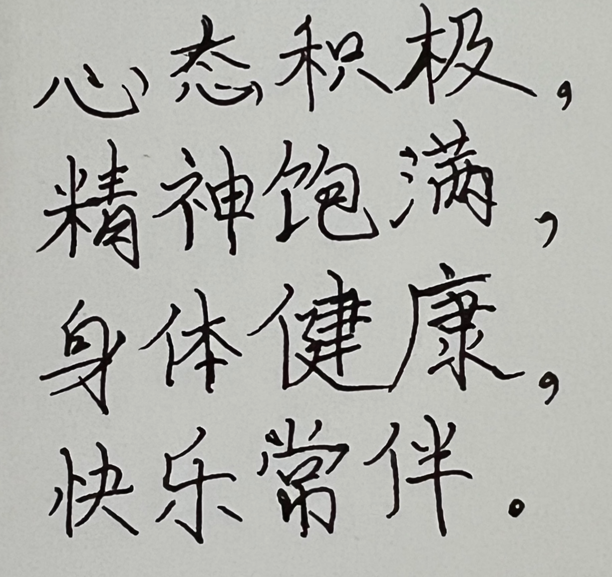

- [Intro](#intro)
- [Setup](#setup)
- [How To Use](#how-to-use)
- [High Level Overview](#high-level-overview)
- [Low Level Overview](#low-level-overview)
- [Limitations](#limitations)

## Intro

As someone who spends a lot of time infront of computers, when it comes to Mandarin texts on the screen, I find myself going back and forth between Google Translate to translate too often.

To simply this process, I thought of a way to screenshot what's in the current browser tab window, and have image extracted and translated, mainly to address texts in the form of picture/images.

Hence, *cometh* the Screenshot Translator Chrome extension.

<br>

## Setup

1. **Run the Tesseract Translator Server**  
   Navigate to the project folder and start the server:  
   ```bash
   npm start     //Listening on localhost:3001
   ```  


2. **Load Chrome Extension into a Chromium-based Browser**
   - Open the **Extensions** page (e.g., `brave://extensions/` for Brave Browser)
   - In the top-left corner, enable **Developer Mode**
   - Click **Load unpacked**
   - Select and load the extension files:  
     `contentScript.js`, `background.js`, `manifest.json`, `popup.html`, `popup.js`

3. **Pin the Extension**  
   - Find the extension named **"Screenshot Translator"**  
   - Click the pin icon to show it next to the browser's address bar

4. **Start the Capture Tool**  
   - Click on the extension icon  
   - Toggle the **Capture Button** to ON  
   - You should now see the **"Start Capture"** button appear on webpages

5. **Disable Ad Blockers (If Necessary)**  
   - Some pages may block scripts; disable shields or ad blockers  
   - For Brave, manually turn off shields for affected sites

<br>

## How To Use

Since this is not offically published through the Chrome Extension Web Store, make sure to refer to [Setup](#setup) to use

1. You can toggle on/off for the button 'Start Capture' to appear on the left top corner to browser window screen.
2. To screen capture a selected area, click 'Start Capture' and drag a rectangular grid over desired Mandarin text
3. A modal will overlay window, containing image, selection of 4 action choices
4. Extract Mandarin text by clicking "Send to OCR"
5. After Mandarin text is extracted, hit "Translate", _voilà_

Try it on these randoms sites
- Children stories - [https://www.gushi365.com/](https://www.gushi365.com/info/8443.html)
- Romance of Three Kingdoms First Chapter - [http://purepen.com/sgyy/001.htm](http://purepen.com/sgyy/001.htm)

<br>

## High Level Overview

1. Capture image
2. HTTP:POST image to localhost:3001/ to extract Mandarin text
3. HTTP:POST Mandarin Text to https://translate.googleapis.com/ to receive English translation of Mandarin as response

## Low Level Overview

1. Optical Character Recognition (OCR) module
   - Runs Tesseract.JS (open-source OCR on Github) on local machine that handles text extraction

2. Chrome Extension (V3)
- **Background Script (`background.js`)** – has access to privileged Chrome APIs such as:  
     - Keyboard shortcuts (via `chrome.commands`)  
     - Screen capture (via `chrome.tabs.captureVisibleTab`)  
     - Cross-tab communication  

   - **Content Script (`contentScript.js`)** – has access to DOM for:  
     - UI elements (capture button, selection box, preview)  
     - User interactions (mouse/touch events)  
     - Selection area drawing  
     - Preview display  

   - **Popup (`popup.html` & `popup.js`)** – User interface for extension settings:  
     - Toggle button state  
     - Settings persistence  
     - User settings interface for users

3. **Capture Initiation**
   - `background.js` (command listener)  
     ↓  
   - Sends `"START_CAPTURE"` message to `contentScript.js`  
     ↓  
   - `contentScript.js` shows capture button/selection UI  

4. **Grid Window Capture**
   - User selects area  
     ↓  
   - `contentScript.js` handles mouse/touch events  
     ↓  
   - Draws selection box  
     ↓  
   - On selection end, sends coordinates to `background.js`  

5. **Post-Capture Process**
   - `contentScript.js` sends `"REQUEST_SCREEN_CAPTURE"`  
     ↓  
   - `background.js` uses `chrome.tabs.captureVisibleTab`  
     ↓  
   - Processes image with coordinates  
     ↓  
   - Sends captured image back to `contentScript.js`  
     ↓  
   - `contentScript.js` shows preview

## Limitations

- Tesseract.js OCR doesn't pick up rotated images well at all, try it with the images below

 
List of children titles
<br>

 

- Texts with graphics in background


- Handwritten/ abstract fonts

  


